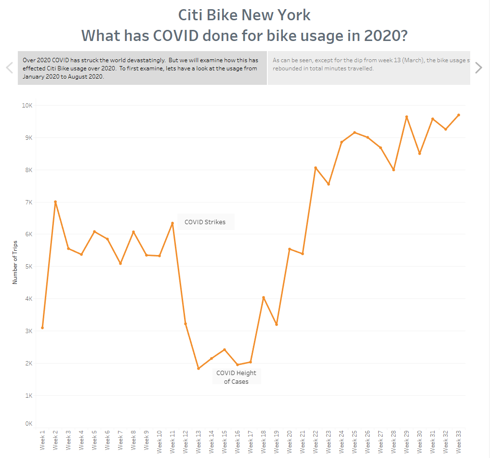
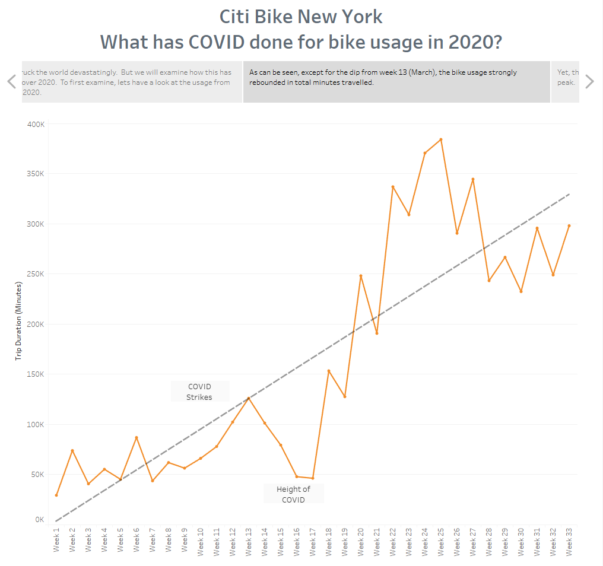
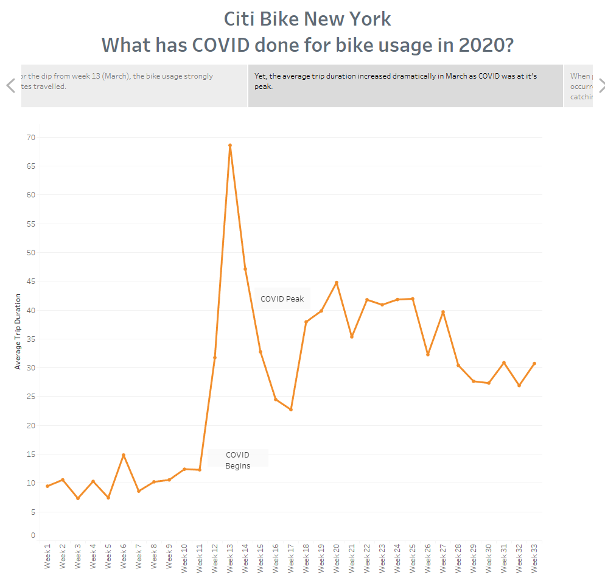
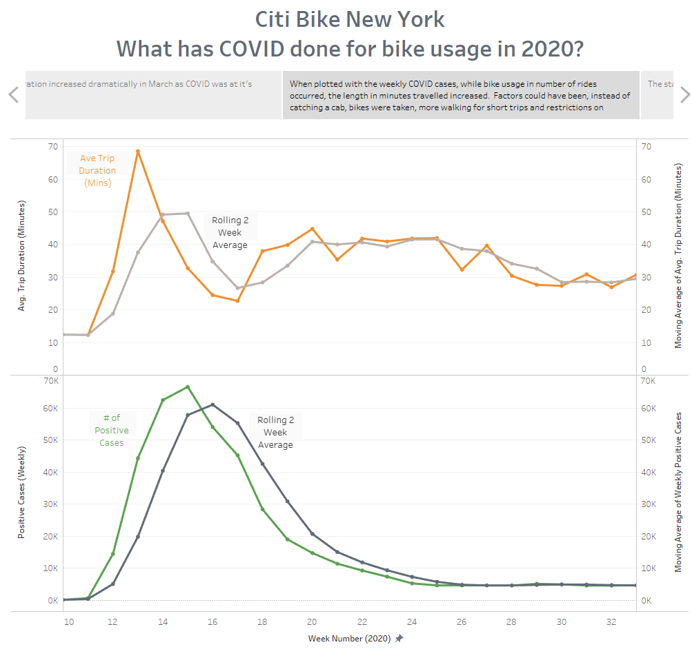
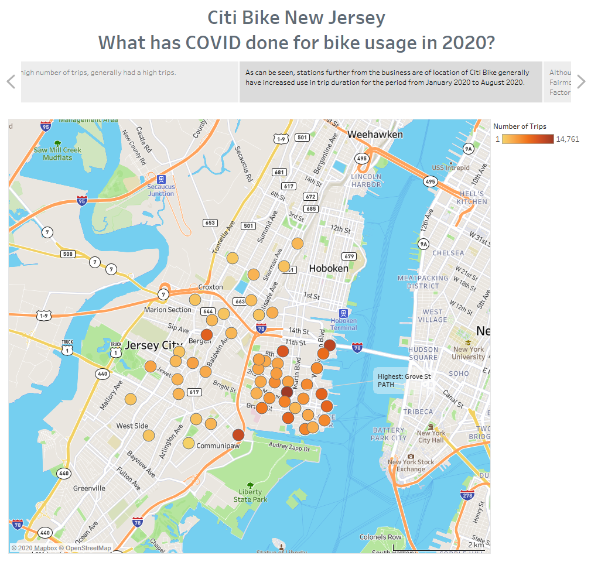
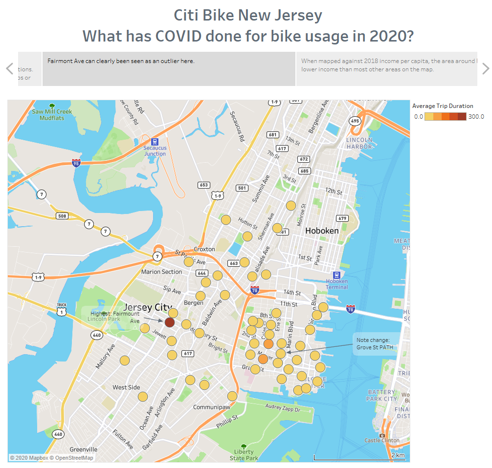
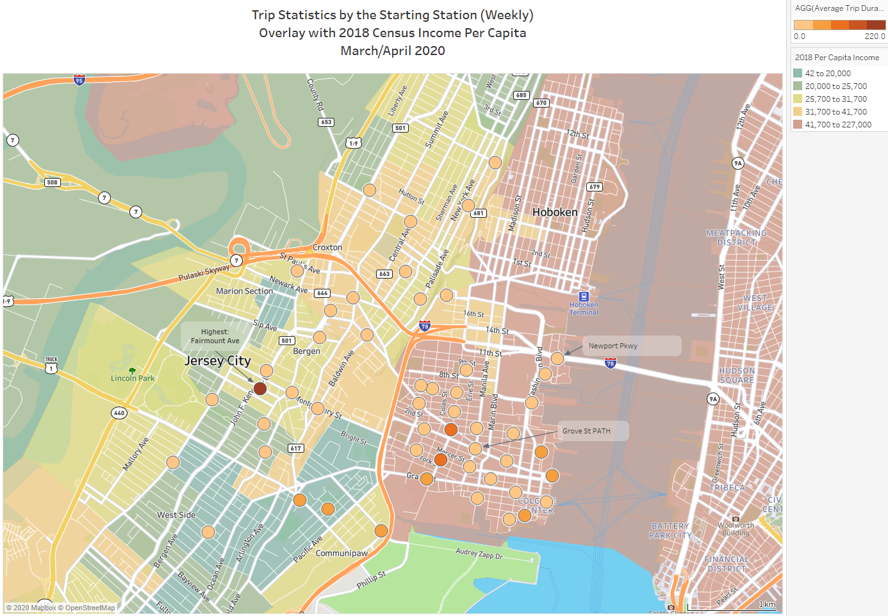

## CitiBike & COVID19 - Did Bike usage increase or decrease?  Were there any demographic factors?

What happened to the Citi Bike system when COVID19 hit?  Did bike usage decrease as restrictions were in place?  As cases increased quickly, did the length of trips decrease?  Were there any demographic factors such as median income, profession or age in certain areas covered by the New Jersey area of Citi Bike?

The task required were to build the following in Tableau:

1. Create 4 -10 Visualisations
2. 2 Dashboards
3. An officifal city map
4. A story

### Background

Congratulations on your new job! As the new lead analyst for the [New York Citi Bike](https://en.wikipedia.org/wiki/Citi_Bike) Program, you are now responsible for overseeing the largest bike sharing program in the United States. In your new role, you will be expected to generate regular reports for city officials looking to publicize and improve the city program.

Since 2013, the Citi Bike Program has implemented a robust infrastructure for collecting data on the program's utilization. 
Through the team's efforts, each month bike data is collected, organized, and made public on the [Citi Bike Data](https://www.citibikenyc.com/system-data)
 webpage.

However, while the data has been regularly updated, the team has yet to implement a dashboard or sophisticated reporting process. 
City officials have a number of questions on the program, so your first task on the job is to build a set of data reports to provide the answers.

### Summary of work completed

1. Obtained data from https://www.citibikenyc.com/system-data
2. Obtained NYC COVID data from https://covidtracking.com/data/download
3. Imported, sorted, joined and cleaned data in a Jupyter Notebook
4. Imported cleaned data into Tableau Public
5. Created visualisations to understand the following 2 questions:

### 1. Did bike usage decrease once COVID19 hit New York City / New Jersey
### 2. Were the demographic factors that may have influenced the bike usage since the pandemic started

## Key Findings

#### 1. Bike usage (total trips made) decreased when COVID hit.

#### 2. Trip Duration (Total Minutes) decreased by about 75k over 8 weeks (weeks 13 - 17), but then increased by approximately 100k in the space of a week (week 18)  There were two further 100k plus minutes per week spikes in usage over the next 4 weeks.

#### 3. The average trip duration duration significantly increased in 2 weeks from about 12 minutes to about 58 minutes.  Trips were taken less but the trip duration was longer.  This was unexpected.

#### 4. Average trip duration peaked approximately 2 weeks before the height of the pandemic.  This was also unexpected and interesting.

#### 5. Grove Street, which has the highest usage from January to August 2020, did not feature in the top 30 for usage in the height of the pandemic.  Conversely, Stations such as Fairmount Ave, had a significant jump in average trip durations.  Could these been due to demographic factors?  Walking in certain areas?

#### 6. There were some demographic factors, with areas such as Fairmont Avenue & Heights Elevator having significant bike usage increases during the pandemic.  Theses areas are not in the top median income bands.

For further charting and analysis, please visit the Tableau public notebook at https://public.tableau.com/profile/tas.tudor#!/vizhome/CitiBike_COVID19/KeyStatsDashboard1

